Index
===
    
*   [Full Stack: Front-to-Back](#full-stack-front-to-back)
*   [2) Pre-flight Check](#2---pre-flight-check)
*   [3) Dynatrace Intro](#3---dynatrace-intro) 
*   [4) Deploy](#4---deploy)
*   [5) Explore: Dynabank](#5---explore-dynabank)
*   [6) Release: Dynabank](#6---release-dynabank)
*   [7) Troubleshoot!](#7---troubleshoot)
*   [8) Customization](#8---customization)
*   [9) Sessions / Session Replay](#9---sessions--session-replay)
*   [A) Azure Specific](#a---azure-specific)
    

[GitHub](https://github.com/dtdave/dbic)

Full Stack: Front-to-Back
=========================

This is designed as an instructor led workshop taking around 3h 30m.

Please join us in a hands-on workshop where we’ll use the power of Dynatrace automation and AI to deploy a real-world application from scratch, immediately get answers to user impacting problems, and encourage collaboration across all IT teams.

It requires login credentials provided by your instructor. If you’re interested in running this workshop yourself or with your organization, please [contact us](https://www.dynatrace.com/contact/)!

Section Overview
===

*   [Overview](#section-overview)
*   [Typical Agenda](#typical-agenda)
*   [Introductions/Housekeeping](#introductionshousekeeping)
    *   [Housekeeping](#housekeeping)

Typical Agenda
--------------

2 Hours:

*   10m Introductions/Housekeeping
*   30m Pre-Flight setup/checklist
*   30m Dynatrace & DynaBank Introduction (and the roles we’ll play today!)
*   10m Deploy Dynatrace & DynaBank
*   30m Explore your new app & how Dynatrace continously maps It
*   10m Deploy a new release into production (What could go wrong?)

20m Leave for the week-end (Q&A and short break)

70 Minutes plus Q&A:

*   20m Root cause analysis with the Davis A.I.
*   20m Customize Dynatrace, Service Level Objectives (SLO’s)
*   30m User Sessions, Session replay
*   Final Q&A and wrap-up

Introductions/Housekeeping
--------------------------

### Housekeeping

*   Phone calls, Restrooms, Breakouts 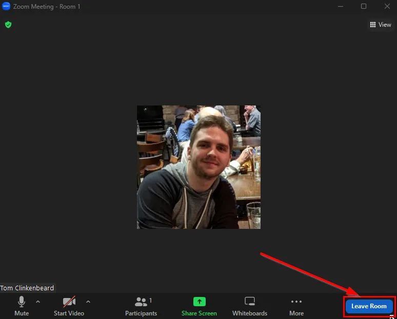

About our group:

*   What does the job description say on your office door? Is it accurate?
*   Have you built a Kubernetes Cluster before? Deployed an Application?
*   Have you used Dynatrace in the last few months?
*   What’s your favorite dinosaur?
*   What was your favorite toy? (Purposeful lack of “childhood”!)

   

2 - Pre-flight Check 
===
 

Section Overview
===

*   [Overview](#section-overview-1)
*   [Environment setup](#environment-setup)
*   [A) Dynatrace tenant setup](#a-dynatrace-tenant-setup)
*   [B) Cloud setup](#b-cloud-setup)
    *   [AWS](#aws)
    *   [AZURE](#azure)
    *   [GCP](#gcp)
*   [C) Setup](#c-setup)

Environment setup
---

We’ll spin up a Dynatrace tenant and build an application together from scratch.

Please keep in mind that this is a “live-fire” experience. It’s instructor led- but can be more like white-water rafting than a museum tour.

Please let us know how it’s going with thumbs up reactions when it’s good sailing and chat/speak up if things are tipping over.

A) Dynatrace tenant setup
-------------------------

1.  Launch the [Dyantrace trial](https://www.dynatrace.com/trial/) page.
2.  Enter an email address and “Start free trial”.
3.  Follow the prompts.
4.  Check email (junk/spam folders!) for a “Welcome” message.

B) Cloud setup
--------------

1.  Dynatrace works natively across cloud providers. Follow the instructor prompts to connect to your selected environment.
2.  Once logged in check the section below matching your provider.

### AWS

1.  In the top right bar, confirm the region is Ohio. If not, click the region and select “US EAST (OHIO)” 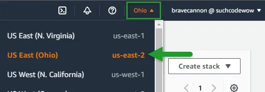
2.  You have full access to the various features of AWS. You could search for “Elastic Kubernetes Service” or “EC2”. Aside from a Cloudformation VPC, everything should be empty as we’ll build it all today.
3.  in the top bar, open an AWS cloud shell session by clicking the shell icon. 
4.  If the text is ridiculously tiny, there is a gear icon in the top right you can select to pick something other than “microscopic”.

### AZURE

1.  Click the shell icon in the top bar of the Azure portal login. 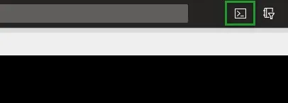
2.  The setup steps should automatically connect you to the correct subscription.
3.  A resource group will be created for you during setup steps. You’ll have full access to all items in this group.

### GCP

1.  In your google cloud console, start a shell from the prompt icon top right. 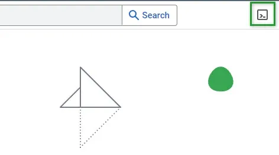
2.  You have full access to the **project** in Google Cloud. Ensure you select your designated project during setup steps.

C) Setup
--------

We’ll use [Pepper](https://github.com/dtdave/scw/blob/Main/docs/pepper/pepper.md) today. It’s a cloud-agnostic deployment assistant built to help setup applications while providing every step along the way. (No magic whooosh then done!)

1.  In your cloud shell, download Pepper.

Terminal window

    curl https://raw.githubusercontent.com/dtdave/scw/refs/heads/Main/pepper/pepper.ps1 -s > ~/pepper.ps1

2.  Start Pepper with the `-c` option to show commands as they run so you could use them manually later, and `-n` option to specify the existing VPC.

Terminal window

    pwsh ./pepper.ps1 -c

Pepper will generate a running checklist of deployment items. Anything showing `[-]` is information, while anything with `[>]` shows the exact command you could run yourself with everything filled it.

3.  You should see something similar to below. Select any items marked `Required`. The step that builds your kubernetes cluster takes some time across all cloud providers. (Some take more than others. _sideways glance at AWS_)

Terminal window

    Option description                     current------ -----------                     -------     1 Switch Cloud Provider           AWS us-east-2/bravecannon     2 Required: Create AWS Components

The first line shows which cloud provider you’re using, the space within that cloud, and a unique identifier. If used in a local terminal with multiple available cloud providers, the option to `switch cloud providers` would let you switch between them.

Section Complete!
-----------------

Congratulations, you’ve built an Kubernetes cluster!

*   Index
    
    *   [Full Stack: Front-to-Back](#full-stack-front-to-back)
    *   [2) Pre-flight Check](#Pre-flightCheck)
    *   [3) Dynatrace Intro](#3---dynatrace-intro)
    *   [4) Deploy](#4---deploy)
    *   [5) Explore: Dynabank](#5---explore-dynabank)
    *   [6) Release: Dynabank](#6---release-dynabank)
    *   [7) Troubleshoot!](#7---troubleshoot)
    *   [8) Customization](#8---customization)
    *   [9) Sessions / Session Replay](#9---sessions--session-replay)
    *   [A) Azure Specific](#a---azure-specific)

    
   

3 - Dynatrace Intro
==================
 

Section Overview
===

*   [Overview](#section-overview-2)
*   [Dynatrace](#dynatrace)
*   [Dynabank](#dynabank)
    *   [Login Page](#login-page)
    *   [Architecture Overview](#architecture-overview)

Dynatrace
---------

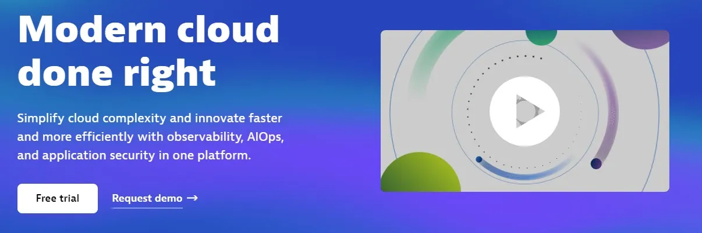

*   Brief overview of [Dynatrace](https://www.dynatrace.com/)
*   [Dynatrace Hub](https://www.dynatrace.com/hub/)

Dynabank
--------

### Login Page
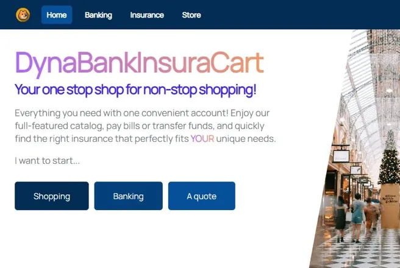

### Architecture Overview
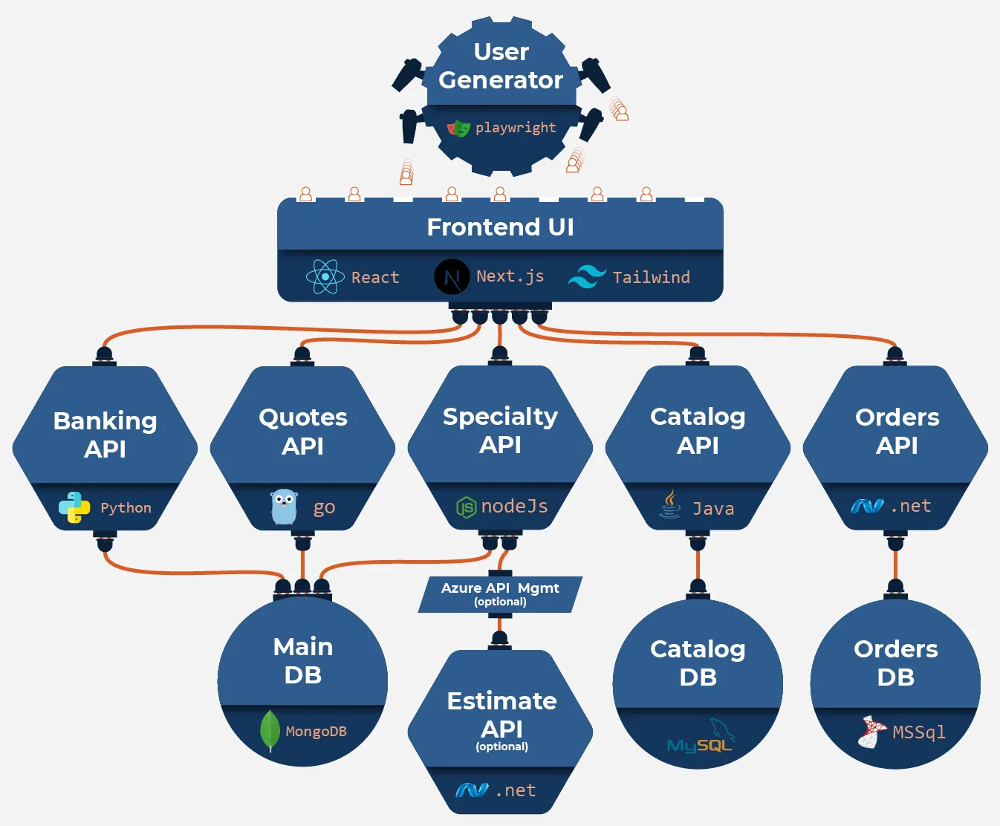

Section Complete!
-----------------

*   Index
    
    *   [Full Stack: Front-to-Back](#full-stack-front-to-back)
    *   [2) Pre-flight Check](#Pre-flightCheck)
    *   [3) Dynatrace Intro](#3---dynatrace-intro)
    *   [4) Deploy](#4---deploy)
    *   [5) Explore: Dynabank](#5---explore-dynabank)
    *   [6) Release: Dynabank](#6---release-dynabank)
    *   [7) Troubleshoot!](#7---troubleshoot)
    *   [8) Customization](#8---customization)
    *   [9) Sessions / Session Replay](#9---sessions--session-replay)
    *   [A) Azure Specific](#a---azure-specific)

   

4 - Deploy
===

 

Section Overview
===

*   [Overview](#section-overview-3)
*   [Dynatrace](#dynatrace-1)
    *   [A) Create a Token](#a-create-a-token)
    *   [B) Save token in Pepper](#b-save-token-in-pepper)
    *   [C) Deploy Dynatrace](#c-deploy-dynatrace)
    *   [D) Confirm Deployment](#d-confirm-deployment)
*   [DynaBank](#dynabank-1)
    *   [E) Deploy DynaBankInsuraCart](#e-deploy-dynabankinsuracart)
    *   [F) Dynabank (Quick) Overview](#f-dynabank-quick-overview)

Dynatrace
---------

Dynatrace provides a managed token system to make deployments secure and easy. In this section, we’ll give Pepper access to the tenant.

### A) Create a Token

Tip

If you have used Dynatrace before it might automatically login to other tenants. Open an “incognito” style browser if that might be the case and login there.

1.  Navigate to your Dynatrace tenant. You should have a welcome email with link.
2.  Once you login, copy the main part of the URL and paste somewhere handy. 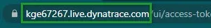

3.  Click “Access Tokens” on the left side very near the bottom. (You might have to expand “Manage”) 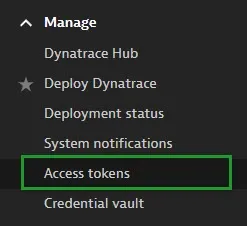
4.  In the tokens screen, click “Generate New Token” on the right side. Give it a name. It could be “fullstack workshop” or “rick”.
5.  In the “search scopes” box, type “write api tokens”, then select the option when it appears below.
6.  Click “Generate Token” at the bottom of the screen. Click Copy on the following screen. Make sure to **copy/paste** your token somewhere safe before clicking done.
7.  Click Done.

### B) Save token in Pepper

1.  In your cloud shell, select the menu option to `create dynakube.yaml`.
2.  Paste your tenant into the tenant ID prompt, then paste the token into the follow prompt.
3.  Pepper will confirm a valid connection and save the token.
4.  Press _enter_ to stop Pepper for now.

### C) Deploy Dynatrace

1.  In your Dynatrace tenant, click “Deploy Dynatrace” in the top right, then “Start installation.”

Alternatively, open the Manage subheading at the bottom of left menu, then “Deploy Dynatrace”

2.  Pick Kubernetes from the most common deployment options. 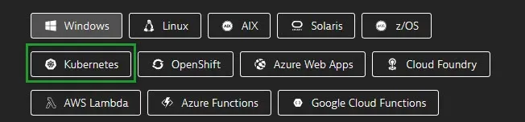
    
3.  Give it a friendly name like “cloudkubernetes” or “morty”.
    
4.  Click “Create token” for Dynatrace Operator & then click “copy” near the bottom. 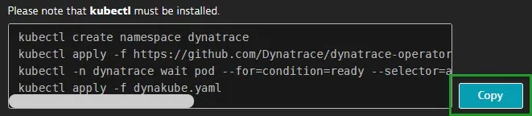

    
5.  In your cloud shell prompt (not Pepper), paste the contents
    
6.  Press _enter_ a couple of times to ensure your cloud provider runs all 4 steps.
    

### D) Confirm Deployment

1.  Restart Pepper.

Terminal window

    pwsh ./pepper.ps1 -c

2.  If you don’t see the new section below showing Dynatrace running 5/5 pods, select the option to “Show Pods”. It might take a few minutes until ready.

Terminal window

    NAME                                  READY   STATUS    RESTARTS   AGEdynatrace-operator-6dfbfd5768-tqk88   1/1     Running   0          3m2sdynatrace-webhook-8954d9c5b-gwrmh     1/1     Running   0          3m2sdynatrace-webhook-8954d9c5b-wgnxp     1/1     Running   0          3m2sk8sagreeableapple-activegate-0        1/1     Running   0          2m15sk8sagreeableapple-oneagent-bw5pm      1/1     Running   0          2m15s

3.  In Dynatrace, you can check on deployment status from the menu. Select “active gates” from the inner menu to confirm Dynatrace is connected.

DynaBank
--------

### E) Deploy DynaBankInsuraCart

Pepper is able to deploy any number of applications via a yaml file. This session has one yaml file for Dynabank.

1.  In Pepper, select the option to `download dempo apps yaml files`.
2.  You’ll see a new application deployment option (similar to Dynatrace) for DynabankInsuracart (dbic).
3.  Select the `dbic: Deploy App` option. Deployment will take a few minutes.
4.  Check the status of deployment with the `dbic: Refresh/Show Pods` option.
5.  When all pods are ready, you can copy the application URL into a new browser. 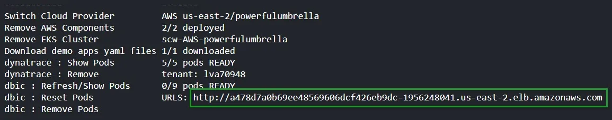

### F) Dynabank (Quick) Overview

Dynabank is your one stop shop for non-stop shopping! You can:

*   find the perfect item you need
*   get insurance quotes for auto & home
*   pay your bills

To facilitate quick demos when you shop or bank, Dynabank will create an account for you including:

*   home address/shipping details
*   checking and savings accounts (here’s hoping for a 5+ digit balance!)
*   a Dynacard credit card

You are also added to the administrators group. Access administration from your account button to see transactions as they process. 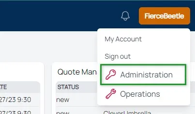

Section Complete!
-----------------

Congratulations, you’ve deployed Dynatrace for end to end observability and a real-world application.

*   Index
    
    *   [Full Stack: Front-to-Back](#full-stack-front-to-back)
    *   [2) Pre-flight Check](#Pre-flightCheck)
    *   [3) Dynatrace Intro](#3---dynatrace-intro)
    *   [4) Deploy](#4---deploy)
    *   [5) Explore: Dynabank](#5---explore-dynabank)
    *   [6) Release: Dynabank](#6---release-dynabank)
    *   [7) Troubleshoot!](#7---troubleshoot)
    *   [8) Customization](#8---customization)
    *   [9) Sessions / Session Replay](#9---sessions--session-replay)
    *   [A) Azure Specific](#a---azure-specific)

   

5 - Explore: Dynabank 
===

 

Section Overview
===

*   [Overview](#section-overview-4)
*   [A) Smartscape](#a-smartscape)
*   [B) Services View](#b-services-view)
    *   [Dynatrace workshops versus real deployment or evaluations](#dynatrace-workshops-versus-real-deployment-or-evaluations)
*   [C) Kubernetes View](#c-kubernetes-view)
*   [D) Databases View](#d-databases-view)
*   [E) Logs](#e-logs)
    *   [Feature Hightlight: full log integration](#feature-hightlight-full-log-integration)
*   [F) Application View](#f-application-view)
    *   [Feature Highlight: Session Replay](#feature-highlight-session-replay)

In this section we’ll look at the front to back visibility provided by Dynatrace immediately after deployment.

We’ll also share a few highlights of user-configurable options available. Any of them could be automated.

A) Smartscape
-------------

1.  In your Dynatrace tenant, select the “Smartscape” option from the menu. You’ll see that Dynatrace has already generated a topology view. 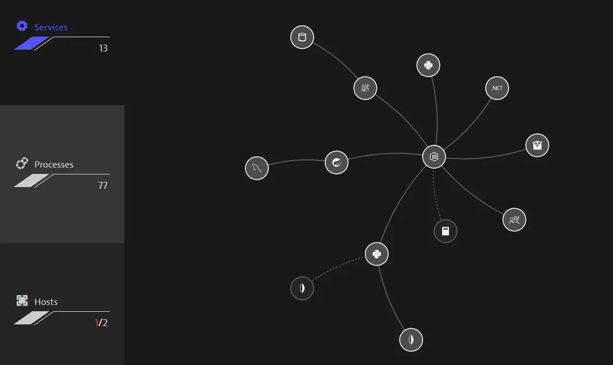

2.  Click any components in Dynatrace to show the automatically tracked vertical relationships for that entity. 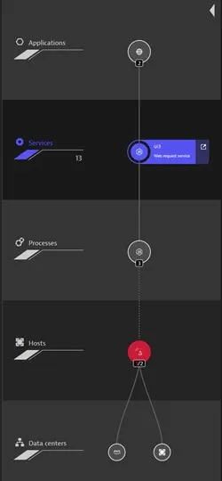

This visibility is unparalled when planning to move applications to another data center or cloud; All dependencies are clearly visible.

B) Services View
----------------

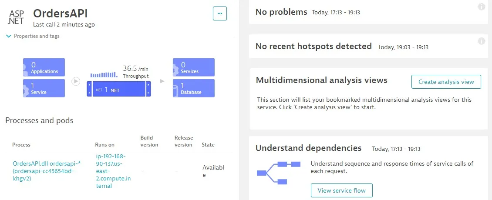

1.  Select “Services” on the left menu. Dynatrace shows all detected services and key metrics for each.
2.  Select the “OrdersAPI” service to see a dashboard and further drilldowns for it:

*   The top left block shows what calls this service, what this service depends on, and where it’s running
*   Bottom left shows service KPI’s like failure rate & throughput
*   Dynatrace always keeps everything connected. The right side shows ways to view the service flow, back up the chain, and individual traces

### Dynatrace workshops versus real deployment or evaluations

While Dynatrace will immediately evaluate every transaction, it builds data and context about the environment for a few hours prior to automatically raising problem cards.

4.  To avoid 6 hour workshops, return to the services screen & click the “flask mainapi” service. 

5.  In the service, click the more button ”…”, then “settings”.
6.  Select “Anomaly Detection”. 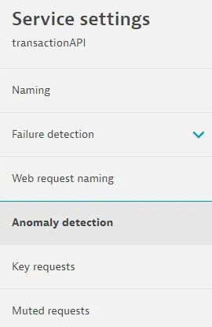

7.  Under **failure rate** switch from automatic detection to “Using fixed thresholds” & set a threshold of “5”%. 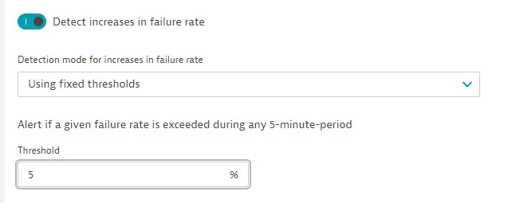

8.  Make sure to save! 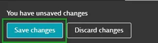

C) Kubernetes View
------------------

1.  Select “Kubernetes” from the left menu (under ), then click on the cluster matching your id.

You’ll see a cluster overview, namespaces, workloads, and the option to turn on cluster events. 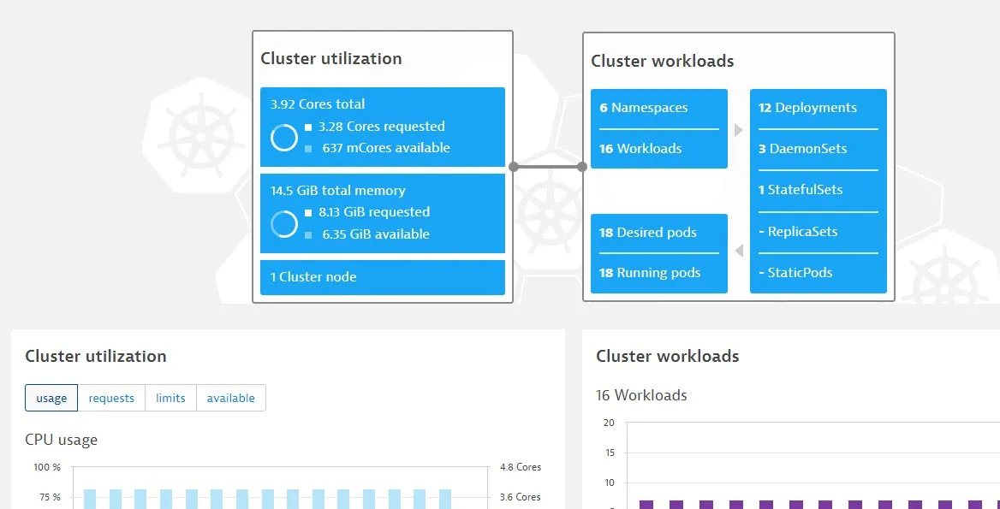

2.  Try clicking on the “dbic” namespace on the lower right to see infrastructure metrics.
    
3.  From here, check out the services running and click ordersAPI.
    
4.  On this page, you can see Dynatrace automatically building visibility up to the services provided & down into the infrastructure.
    

D) Databases View
-----------------

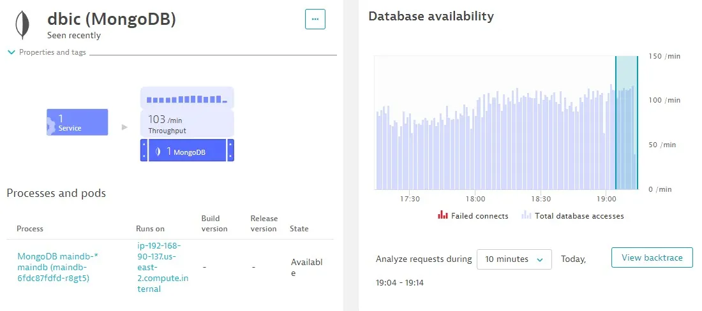

1.  Select “Databases” on the left menu, then “dbic”. Similar to services, Dynatrace constantly tracks service dependencies, and underlying infrastructure at all times.
2.  Database calls from any source are shown here with the ability to reverse back up the chain with the “view backtrace” button.

E) Logs
-------

### Feature Hightlight: full log integration

1.  In Settings -> Log Monitoring -> Log sources and storage, check the box for the host to enable log integration. 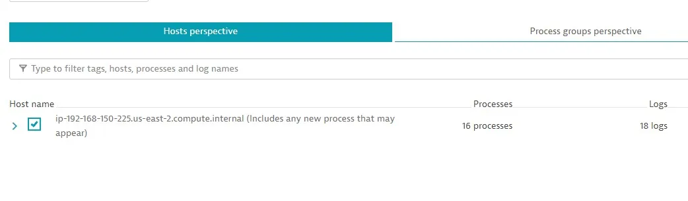

2.  Make sure to save changes! 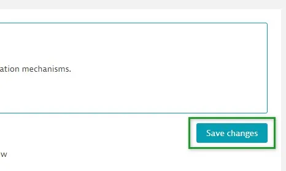

3.  **Hang tight for a couple of minutes.**
4.  Select “Logs” on the left menu.
5.  Select from log types, messages, and sources in “available attributes”. 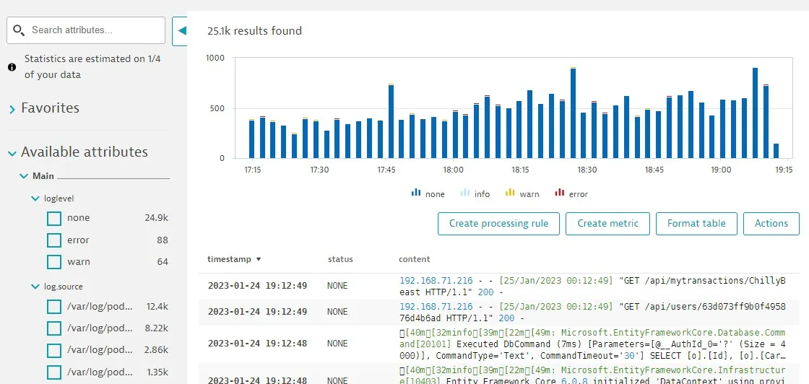

F) Application View
-------------------

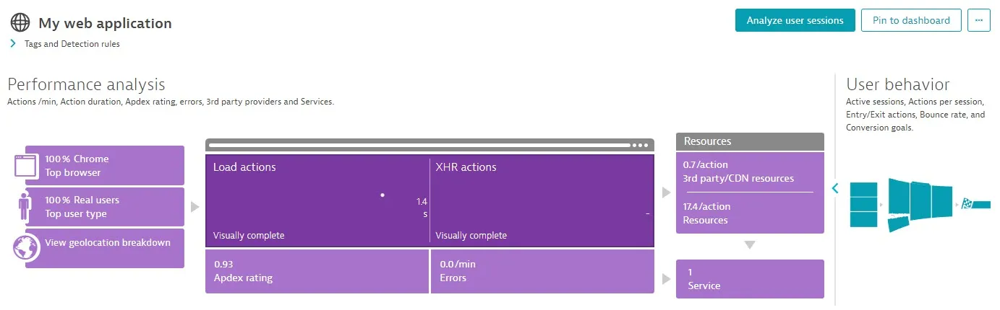

1.  Select “Frontend” on the left menu (under “Applications & Microservices”)
2.  Select “My Web Application”
3.  Select “1 service” in the lower right of top box. 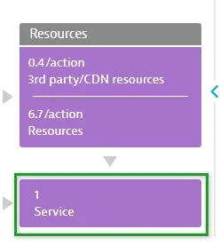
4.  Select “view service flow” to show this applications ecosystem front to back.

Tip

It’s easy to split applications into their own views. It’s done by selecting the ”…” in the applications view and “editing detection settings”

### Feature Highlight: Session Replay

1.  Return to the main application page.
2.  Edit the application with the more button ”…” top right.
3.  In Capturing -> Async web requests and SPAs, enable both options under “Generic Support”. 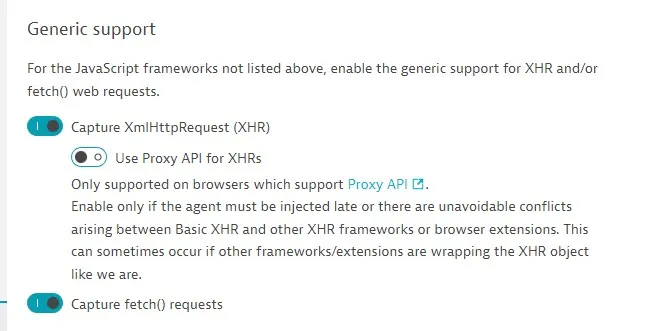

4.  Enable Session Replay from the “enablement and cost control” page (under “General Settings”). 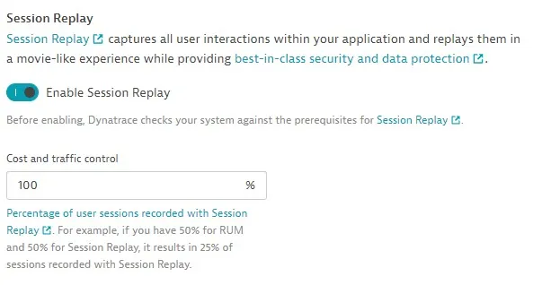

5.  (Optional!) In the “Data Privacy” -> “Session Replay” section, select the “Recording” and then “Block List.” Do the same for “Playback”.
6.  (Optional!) Dynatrace defaults to high security settings. You can unblock all items to see everything in the replay today. 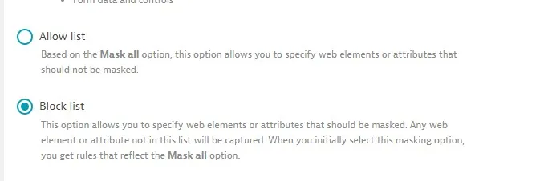

7.  Make sure to save! 

Tip

Dynatrace offers granular control at the point of capture for security and privacy. Your organization’s needs might be open, closed, or a very unique combination. For today’s session, it’s often more interesting to allow more visibility to see replay capabilities in realtime.

Section Complete!
-----------------

Congratulations, you’ve successfully explored your application in Dynatrace!

*   Index
    
    *   [Full Stack: Front-to-Back](#full-stack-front-to-back)
    *   [2) Pre-flight Check](#Pre-flightCheck)
    *   [3) Dynatrace Intro](#3---dynatrace-intro)
    *   [4) Deploy](#4---deploy)
    *   [5) Explore: Dynabank](#5---explore-dynabank)
    *   [6) Release: Dynabank](#6---release-dynabank)
    *   [7) Troubleshoot!](#7---troubleshoot)
    *   [8) Customization](#8---customization)
    *   [9) Sessions / Session Replay](#9---sessions--session-replay)
    *   [A) Azure Specific](#a---azure-specific)

   

6 - Release: Dynabank
====================

 

Section Overview
===

*   [Overview](#section-overview-5)
*   [The story so far](#the-story-so-far)
*   [Enable the service](#enable-the-service)

The story so far
----------------

The organization is implementing a fraud detection service.

*   Large transactions are targets for fraud.
*   The fraud service will check those transactions for address and account owner details prior to posting them.
*   Users should receive a transaction error message when fraud is detected.

As developers:

*   we’ve confirmed the solution works on our dev laptops.
*   We’ve staged the change as a feature flag in the application’s main API.
*   At 4:50PM Friday we put on our jackets, enable the flag, and start a week long beach vacation.

Enable the service
------------------

Your DynaBank account is authorized to deploy new software features!

1.  Open the Operations panel of DynaBankInsuraCart. 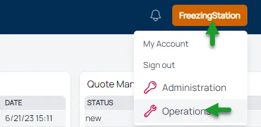

    
2.  Enable the Fraud Detection service. 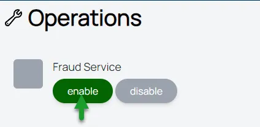

    
3.  Take a well deserved week long vacation!
    

*   Index
    
    *   [Full Stack: Front-to-Back](#full-stack-front-to-back)
    *   [2) Pre-flight Check](#Pre-flightCheck)
    *   [3) Dynatrace Intro](#3---dynatrace-intro)
    *   [4) Deploy](#4---deploy)
    *   [5) Explore: Dynabank](#5---explore-dynabank)
    *   [6) Release: Dynabank](#6---release-dynabank)
    *   [7) Troubleshoot!](#7---troubleshoot)
    *   [8) Customization](#8---customization)
    *   [9) Sessions / Session Replay](#9---sessions--session-replay)
    *   [A) Azure Specific](#a---azure-specific)

7 - Troubleshoot!
================

Section Overview
===

*   [Overview](#section-overview-6)
*   [The story even further](#the-story-even-further)
*   [Enter Dynatrace](#enter-dynatrace)
*   [Companies using this today](#companies-using-this-today)

The story even further
----------------------

*   After an hour or so, the support center starts a priority conference call.
*   They report that customers are receiving payment success messages but transactions don’t post.
*   Someone suggests that the network must be down. The network team is paged, searches for an hour, and finds no issue.
*   The network team suggests last time this happened their might have been a database error.
*   The database team is paged.
*   Hours pass and more teams are called.

Enter Dynatrace
---------------

Just kidding. That didn’t happen. 

With Dynatrace, any problem in the enterprise affecting users is automatically analyzed and the Davis AI provides root cause.

1.  Open the Problems Pane in Dynatrace, or click the exclamation point at top right.

Tip

Dynatrace has a full suite of options to route problem types to an array of email, notification, and customizable integrations.

2.  Click on the “failure rate increase” problem.

You’ll see start and end time of the problem, user impact analysis, and the root cause of the problem.

Tip

Incidentally, all of the other context is present to clearly show where the problem **isn’t**. By clicking on the “python” box top left, you can jump right into the host and confirm all infrastructure is A-OK.

3.  Click on the failing service in red.

With Dynatrace, you’ll see critical context in black/blue and the reason for the alert in red.

4.  Quick aside: Dynatrace shows the python services and databases in blue. Dynatrace automatically checked all of the network traffic and databases on the way to providing you root cause.
    
5.  Click on Failure rate to see a view of service performance with the problem area highlighted.
    
6.  Click Analyze failure rate degradation to see root-cause error message, faulty service, and automatic integration with relevant logs. 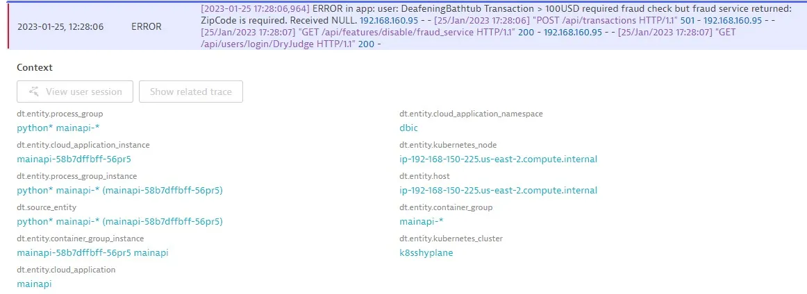

    

With Dynatrace you have immediate full visibility front to back.

7.  Disable the fraud service. On the end of the base URL, add:

Terminal window

    /api/api/features/disable/fraud_service

8.  Review the transactionAPI for decrease in failures. After a few minutes without user users, Dynatrace will automatically close the ticket.

Companies using this today
--------------------------

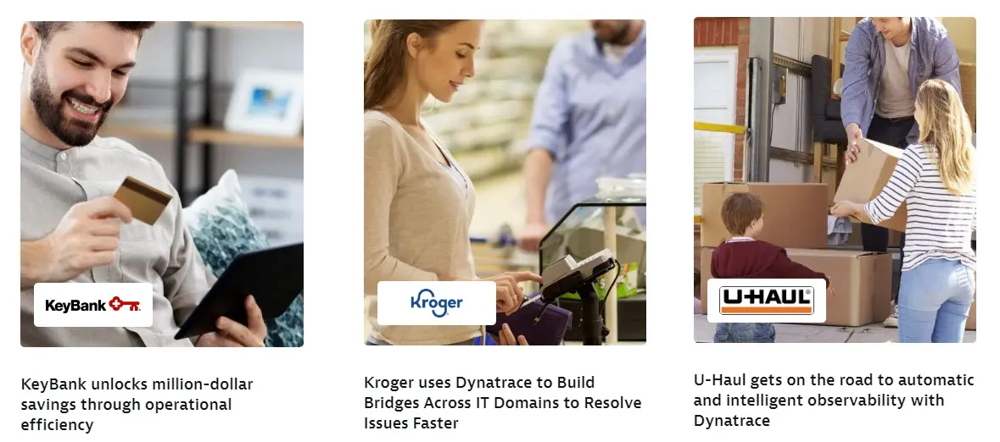

[Click for many more enterprise success stories.](https://www.dynatrace.com/news/customers/)

*   Index
    
    *   [Full Stack: Front-to-Back](#full-stack-front-to-back)
    *   [2) Pre-flight Check](#Pre-flightCheck)
    *   [3) Dynatrace Intro](#3---dynatrace-intro)
    *   [4) Deploy](#4---deploy)
    *   [5) Explore: Dynabank](#5---explore-dynabank)
    *   [6) Release: Dynabank](#6---release-dynabank)
    *   [7) Troubleshoot!](#7---troubleshoot)
    *   [8) Customization](#8---customization)
    *   [9) Sessions / Session Replay](#9---sessions--session-replay)
    *   [A) Azure Specific](#a---azure-specific)

   

8 - Customization
================

 

Section Overview
===

*   [Overview](#section-overview-7)
*   [Easy ways to make Dynatrace your own](#easy-ways-to-make-dynatrace-your-own)
*   [A) Service Request Attributes](#a-service-request-attributes)
*   [B) Application Tags](#b-application-tags)
*   [C) Dashboards](#c-dashboards)

Easy ways to make Dynatrace your own
------------------------------------

A) Service Request Attributes
-----------------------------

1.  Click “Settings” under “Manage”.
2.  On inner menu, click “request attributes” under “Server-side service monitoring”. 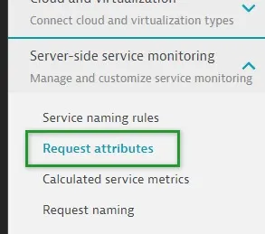

3.  Click “Define new Request Attribute” at the top.
4.  Use the following values:

Setting

Value

_Request attribute name_

Any friendly name

Allow this request to access unmasked personal data

checked

All service technologies

node.js

Request Attribute Source

Web request URL Path

Preprocess parameter by extracting substring

**after** /api/main/users/login/

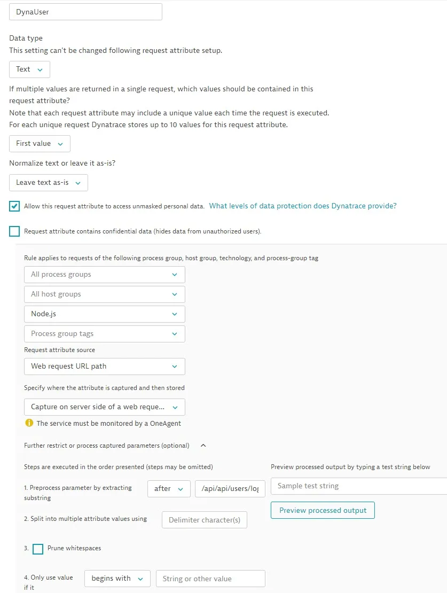

5.  **Make sure** to save your attribute source.
6.  **Make sure** to click “save” in the top right corner.

B) Application Tags
-------------------

4.  Click “Frontend” in the menu (under “Applications & Microservices”).
5.  Click “my web application”, then the ”…” button, then “edit”. 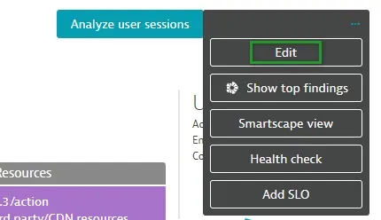

6.  In the inner menu, select Capturing -> User tag & specify settings as shown.

Setting

Value

Source Type

Server side request attribute

Request Attribute

DynaUser (or whatever you selected)

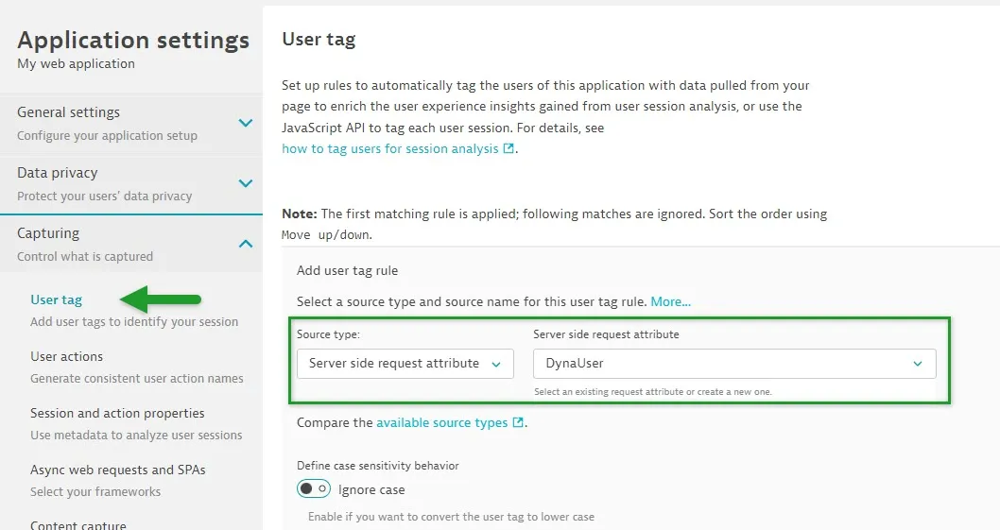

7.  Make sure to save! 
    
8.  Hang tight for just a minute or two and then return to “My web application” (from the main “frontend” menu)
    
9.  Click “Analyze user sessions” in the top right. 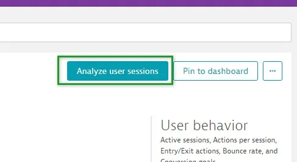

    

After a short time, you’ll see Dynatrace associate users with their sessions.

C) Dashboards
-------------

Hopefully you’ve seen that Dynatrace goes way beyond dashboards by watching every transaction, click, and process for you and simply raising problem cards when negative events occur. But Dynatrace has a full suite of dashboard capabilities built in.

1.  Click “Dashboards” on the top left and then select a specific dashboard from the list- or you can choose to make your own.
2.  Your own dashboard might include:

*   Services health view
*   Databases
*   Problems
*   Network Status

Or use the data explore for some really run options:

*   Kubernetes workloads by type
*   Server side response times

3.  Share the dashboard with others using the more button ”…” top right -> share.

Section Complete!
-----------------

You've successfully see how Dynatrace can be tailored to your specific needs.

*   Index
    
    *   [Full Stack: Front-to-Back](#full-stack-front-to-back)
    *   [2) Pre-flight Check](#Pre-flightCheck)
    *   [3) Dynatrace Intro](#3---dynatrace-intro)
    *   [4) Deploy](#4---deploy)
    *   [5) Explore: Dynabank](#5---explore-dynabank)
    *   [6) Release: Dynabank](#6---release-dynabank)
    *   [7) Troubleshoot!](#7---troubleshoot)
    *   [8) Customization](#8---customization)
    *   [9) Sessions / Session Replay](#9---sessions--session-replay)
    *   [A) Azure Specific](#a---azure-specific)

   

9 - Sessions / Session Replay
============================
    
    

Section Overview
===

*   [Overview](#section-overview-8)
*   [User Sessions overview](#user-sessions-overview)
*   [User Replay overview](#user-replay-overview)

User Sessions overview
----------------------

Overview of User Sessions in Dynatrace.

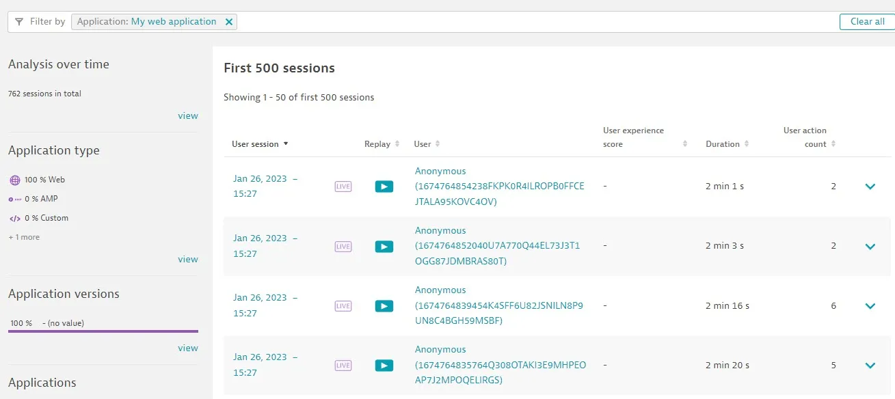

User Replay overview
--------------------

Overview of Session Replay in Dynatrace.

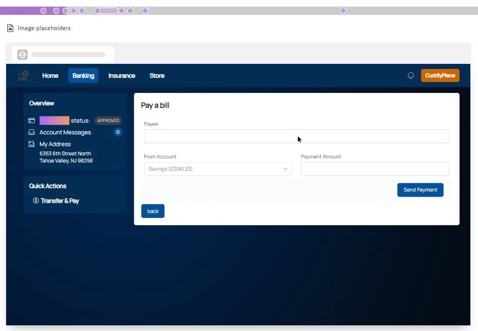

*   Index
    
    *   [Full Stack: Front-to-Back](#full-stack-front-to-back)
    *   [2) Pre-flight Check](#Pre-flightCheck)
    *   [3) Dynatrace Intro](#3---dynatrace-intro)
    *   [4) Deploy](#4---deploy)
    *   [5) Explore: Dynabank](#5---explore-dynabank)
    *   [6) Release: Dynabank](#6---release-dynabank)
    *   [7) Troubleshoot!](#7---troubleshoot)
    *   [8) Customization](#8---customization)
    *   [9) Sessions / Session Replay](#9---sessions--session-replay)
    *   [A) Azure Specific](#a---azure-specific)

    

A - Azure Specific
=================

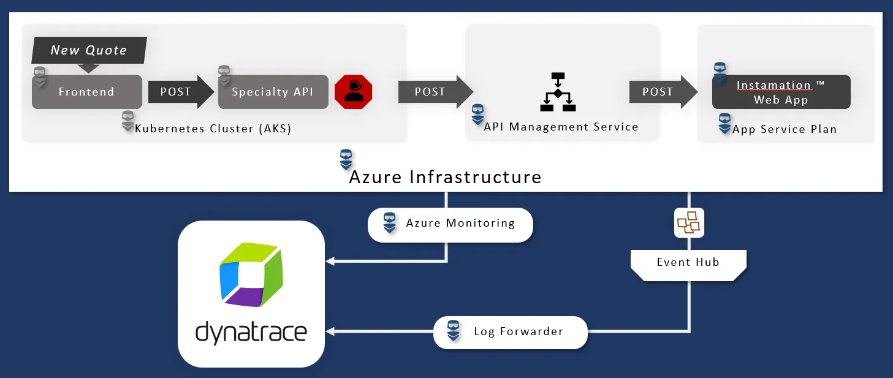

Instamation on Azure (Azure Web App)
------------------------------------

Our company has instructed us to build and deploy a modern quoting service.

We’ve developed Instamation (tm) and chosen to deploy it as an Azure Web App for easy scalability and configuration.

### Deploy

1.  In the Azure Console, go to “App Services.”
2.  Type your class id (sessionX#) into the filter top right.
3.  You should see just ONE web app and click to select. It will be in the _format scw-webapp-\[classname\]_.
4.  Select the Deployment Center (blue highlight) then External Git as the source (green highlight).  
    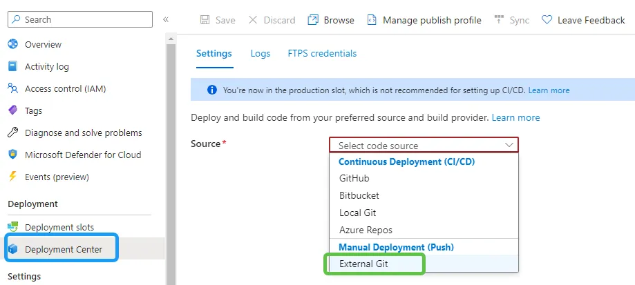
5.  Copy the following service repository link into the repository field:

Terminal window

    https://github.com/suchcodewow/instamationsvc

1.  Type `main` for the branch (blue highlight) then Save (green highlight).
    
    Tip
    
    The “example/grey” branch example is also named main. You do need to type `main` into this field to be able to save.
    
    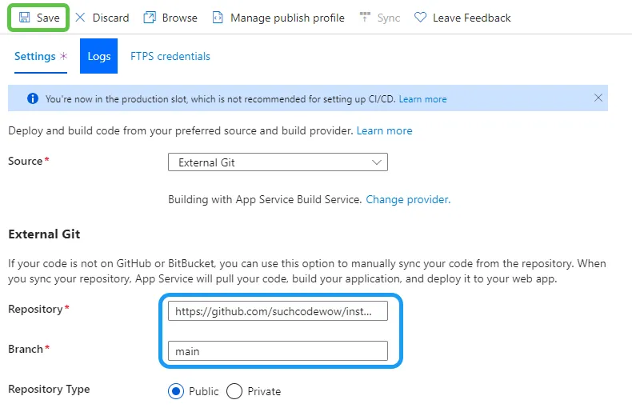
2.  Go back to the overview page (blue highlight) and click the default domain (green highlight) to see your new service.  Azure Specific _ suchcodewow_files/awa3.DbCKiXYY_2d79Ri.webp)
3.  The deployment will likely take a minute or two. You might see a boilerplate message the first time you click- or it might not respond. When successfully deployed, you should see a simple json response simlar to:

Terminal window

    {"status":"ready","appname":"scw-webapp-[classname]"}

When this appears, it means your service is working! You are ready to move to the next step.

### Dynatrace Extension

1.  In the inset-menu, click on _Extensions_ within the _Development Tools_ section.
2.  Click Add in the main window. Search/Find Dynatrace Oneagent and select it: 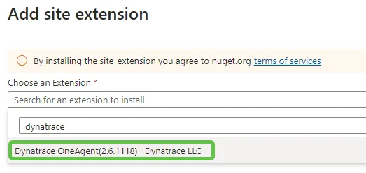
3.  At the bottom of the panel, check the agreement box, then click _Add_.
4.  Hang tight for a few seconds until it loads, then click the small browse box: 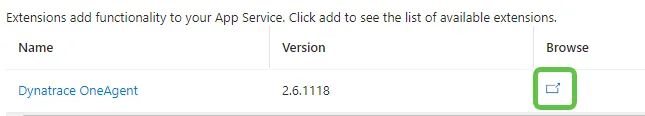
5.  Briefly switch to Tab #1. In Pepper, choose the option for `Dynatrace: Token Details`. You might need to scroll up slightly to see the output.
6.  Using the image below as a guide, fill in the environment ID, token, and then the server URL. 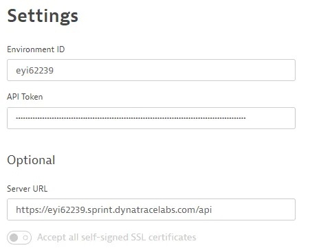
7.  Click _Install OneAgent_ and hang tight until you see _Enjoy monitoring from Dynatrace._ at the top of the screen.
8.  In the _Overview_ page of your web app, click the _Restart_ button.

### Dynabank & Azure Web App

1.  In Tab #6 showing the Instamation service API response, copy the URL from the address bar.
2.  In Dynabank, Log-in using any random name provided with the orange button top right.
3.  Click the orange button top right and click _Operations_. 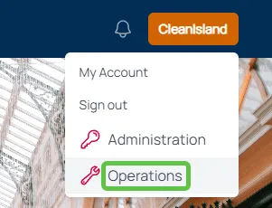
4.  In the _Estimation Service URL box_, paste in the URL of the Instamation service, then click _save_.
5.  Confirm it worked by checking for a _successfully configured_ message. The App Name should reflect your user id (sessionX#). (The value is retrieved directly from your web service to make sure it worked.) 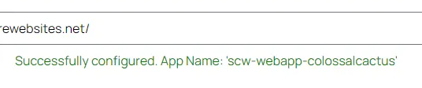
6.  New Collecticare quotes will now automatically by quoted by the Instamation Service. You can check on it by going to Administration: 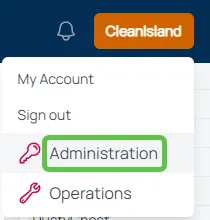
7.  Review new Collecticare quotes on the first administration panel. Instead of quotes showing up in the _new_ state, they will show as _quoted_ instead: 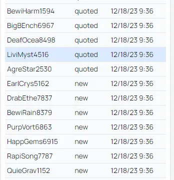

#### Diagnostic settings

1.  Back in Tab #3, scroll down to diagnostic settings and click (green box).
2.  Click _Add Diagnostic Setting_. 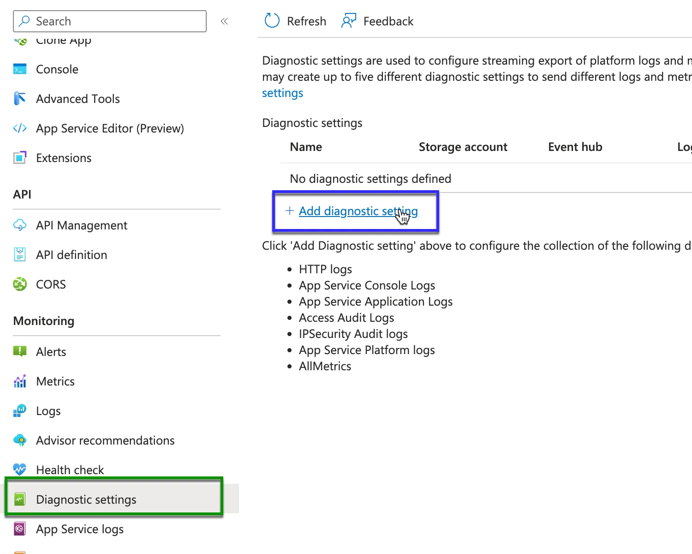
3.  Click _App Service Application Logs_ (green box) and click _Stream to Event Hub_ (blue box).
4.  Make sure the hub namespace matches below & select the shown event hub. 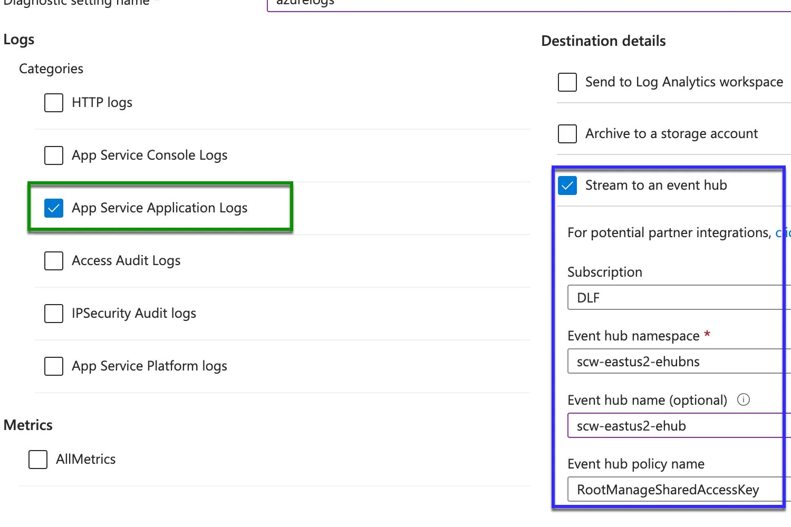
5.  Click _save_ in the top left corner.

Hands On: API Mgmt
------------------

### Deployment

Once the Dynabank business teams confirmed initial success of Instamation, our next goal is to configure it to use Azure API Management.

1.  In Tab #3 Azure Portal, search for ‘APIM’ and click on _API Management services_.
2.  Click on the APIM for your region in the format _scw-\[region\]-apim_.
3.  Click on _API’s_ from the inset-left menu: 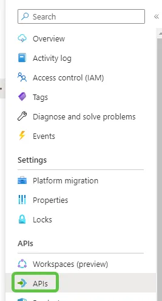
4.  And then click on _App Service_. 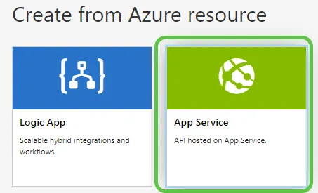
5.  Click the `Browese` button.
6.  Type in your id (sessionX#). You should see ONE matching App Service. Select the App Service & click select at the bottom.
7.  Copy the name provided into the API URL suffix box. Your Base URL should look something like:

Terminal window

    https://scw-useast2-apim.azure-api.net/scw-webapp-colossalcactus

1.  Click _Create_.
2.  Find your API in the list, click on it (blue highlight), and then click _Settings_ at the top of the details box to the right (green highlight): 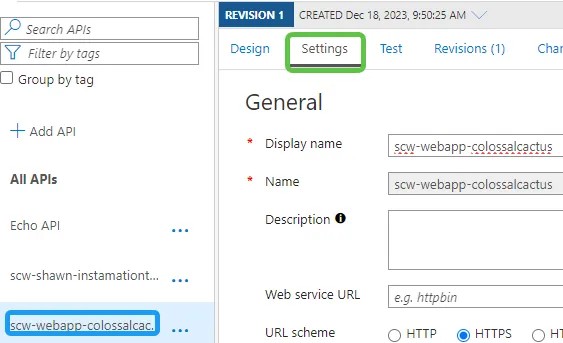
3.  Uncheck the _Subscription required_ option box (blue highlight). Click Save (green highlight). This will allow all connections to reach your Instamation service. 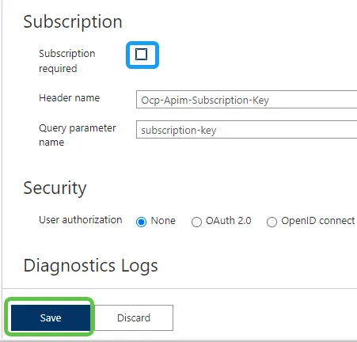

:::tip Lab vs Real World In a real-world scenario we wouldn’t go without a subscription/authorization mechanism. We’re doing it here to keep the focus on Observability vs application configuration. Dynatrace will detect all traffic just fine with any configuration. :::

1.  Before leaving this screen, find the _Base URL_ of your service and copy it.
2.  Confirm it worked by pasting this URL into a new tab of your browser. You should see your service respond just fine behind the apim!
3.  In your Dynabank Operations portal (click orange button top right -> Operations), you can replace the Instamation Web App with the APIM version and click _save_. You should receive the same _succesfully configured_ message.

Hands On: Azure Log Forwarder
-----------------------------

With metrics and traces automatically ingested and baselined, our company wants to include logs as well. The Collecticare development teams use logs to write out critical business information like policy estimates and quoting decisions.

### Deployment

1.  In Tab #1, run the Pepper command to retrieve Dynatrace token information.
2.  Drag-select all EXPORT commands shown. Right-click and copy. Press _ENTER_ to quit Pepper.
3.  At the BASH command prompt, paste the EXPORT commands and press _ENTER_.
4.  Copy the Log Forwarder function below & paste it into the terminal window.

Terminal window

    wget -q https://github.com/dynatrace-oss/dynatrace-azure-log-forwarder/releases/latest/download/dynatrace-azure-logs.sh -O dynatrace-azure-logs.sh && chmod +x ./dynatrace-azure-logs.sh \&& ./dynatrace-azure-logs.sh --deployment-name $DEPLOYMENT_NAME --target-url $TARGET_URL --target-api-token $TARGET_API_TOKEN --resource-group $RESOURCE_GROUP --event-hub-connection-string $EVENT_HUB_CONNECTION_STRING --require-valid-certificate true

1.  It will take a few minutes to deploy all resources.

Hands On: Azure Monitor
-----------------------

### Deployment: Service Principal

1.  On Tab #1 in the terminal, exit Pepper if it is running.
2.  Run the command below to generate a Service Principal/App Registration:

Terminal window

    az ad sp create-for-rbac --name $DEPLOYMENT_NAME --role reader --scopes /subscriptions/9939cbf8-8de6-49a1-a641-b664b214838f --query "{ClientID:appId,TenantID:tenant,SecretKey:password}"

1.  In Tab #4 Dynatrace, Open the Settings App —> Cloud and Virtualization —> Azure.
2.  Click on Connect New instance.
3.  Choose a name for the connection.
4.  Add the ClientID, SecretKey and TenantID that exported from the Terminal Command line /Azure CLI.
5.  Click Connect. That’s it!
6.  Open the Azure App in Dynatrace to see all resources.

Tip

Since we’re running many copies of Dynabank in a ‘multiverse’ kind of scenario, you’ll obviously see them all in our Azure Classroom.  
But it does show how easily Dynatrace provides full visibility into an Azure environment with all services instantly tracked, organized, and tagged for easy business organization.

Bonus Hands On: Grail!
----------------------

### Introduction

The deployment of Instamation by Dynabank after the Collecticare acquisition was a great success technical success.  
With Dynatrace, we have full visibility into the entire quoting process and can see that quotes are fast and error free.

A big win!

Except that… the underwriting department is in a complete PANIC! 
 The automated instamation quoting system has produced quotes for $1 on extremely expensive items that will cause serious financial problems for Dynabank.

We can easily double-check that all quotes work technically. What could be going on?

### Logs and Business Events on Grail

With the Grail framework powering Log and Business Event ingestion, we can quickly dive into problems in business flows beyond technical issues.

1.  Download this [Grail notebook template](https://suchcodewow.io/manifests/ditl.json).
2.  On Tab #4 Dynatrace, open the Notebooks App.
3.  Click to create a new notebook.
4.  On the left inset panel, choose _Upload_.
5.  We’ll step through each example to see how Grail powers solutions beyond technical issues.

*   Index
    
    *   [Full Stack: Front-to-Back](#full-stack-front-to-back)
    *   [2) Pre-flight Check](#Pre-flightCheck)
    *   [3) Dynatrace Intro](#3---dynatrace-intro)
    *   [4) Deploy](#4---deploy)
    *   [5) Explore: Dynabank](#5---explore-dynabank)
    *   [6) Release: Dynabank](#6---release-dynabank)
    *   [7) Troubleshoot!](#7---troubleshoot)
    *   [8) Customization](#8---customization)
    *   [9) Sessions / Session Replay](#9---sessions--session-replay)
    *   [A) Azure Specific](#a---azure-specific)
